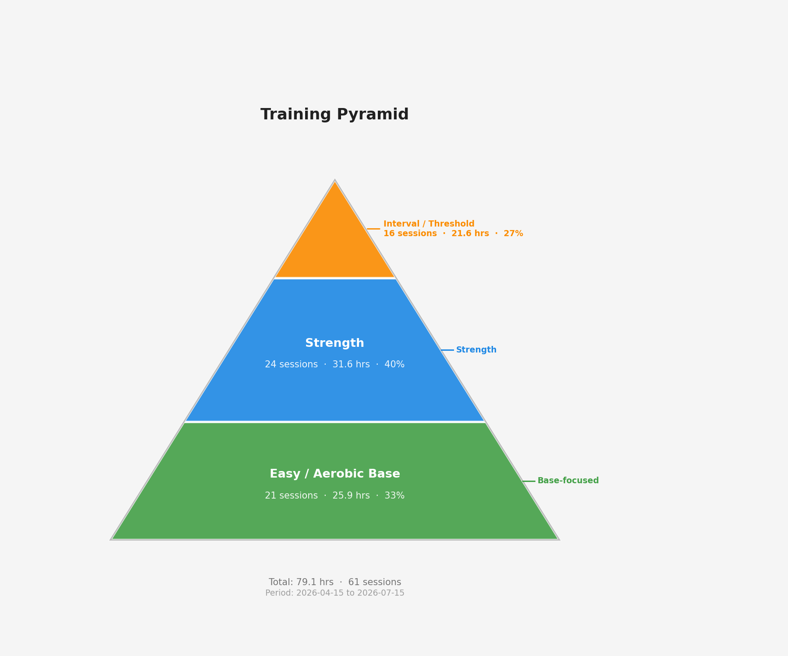

# theEagle

Python tools for Garmin FIT analysis for half-marathon training, with separate workflows for easy runs, interval/high-intensity sessions, and strength sessions.

Compatibility note: This workflow has been fully tested only with Garmin Forerunner 255 FIT exports. Other devices may work but are not yet fully validated.

Full operational guide: [docs/guides/how-to-run.md](docs/guides/how-to-run.md)

Download and place FIT files: [docs/guides/download-fit-files.md](docs/guides/download-fit-files.md)

Documentation index: [docs/guides/docs-index.md](docs/guides/docs-index.md)

Project structure standard: [docs/guides/project-structure.md](docs/guides/project-structure.md)

Contribution guide: [CONTRIBUTING.md](CONTRIBUTING.md)

## What This Project Does

- Parse Garmin FIT files into structured CSV outputs.
- Analyze easy-run aerobic efficiency and decoupling trends.
- Analyze interval/tempo/threshold/speed adaptation trends.
- Analyze strength-endurance interaction and recovery cost.
- Keep reports separated by workout type.

## Standard Data Folders

Place FIT files into:

- data/activities/easy/raw
- data/activities/interval/raw
- data/activities/strength/raw
- data/activities/general/raw

Parsed outputs go to:

- data/activities/<category>/processed/<fit_file_stem>/

## Report Folders (Separated)

- Easy reports: reports/easy
- Interval reports: reports/interval
- Strength reports: reports/strength

## CLI Commands

Initialize standard folders:

```powershell
uv run python main.py init
```

Parse FIT files:

```powershell
uv run python main.py parse --category all
uv run python main.py parse --category easy
uv run python main.py parse --category interval
uv run python main.py parse --category strength
uv run python main.py parse --file data/activities/easy/raw/my_run.fit --category easy
```

Run separated reports:

```powershell
uv run python main.py easy-report
uv run python main.py interval-report
uv run python main.py strength-report
```

Download FIT files from Garmin Connect:

```powershell
uv run python main.py download-fit --category easy --activity-id 23038610778
```

Downloaded FIT naming standard:

- `yyyy-mm-dd_dayoftherun_category.fit`
- Example: `2026-05-28_thursday_easy.fit`
- Date and weekday are derived from the activity's local start timestamp metadata, not local download time.

## Help

If you are unsure what to run, start with:

```powershell
uv run python main.py
```

That prints the built-in command help, including the most common workflows:

- `init` to create the standard folder layout
- `parse` to convert FIT files into CSV outputs
- `easy-report` to generate the easy-run HR scorecard and plot
	- `easy-score` remains available as a backward-compatible alias
- `interval-report` to analyze interval / tempo / threshold sessions
- `strength-report` to analyze strength-endurance sessions
- `run-all` to run the combined parse-and-report workflow

For a step-by-step walkthrough, see [docs/guides/how-to-run.md](docs/guides/how-to-run.md).

## Quick Start

```powershell
# 1) install dependencies
uv sync

# 2) create folders
uv run python main.py init

# 3) add FIT files to raw folders by category

# 4) parse files
uv run python main.py parse --category all

# 5) generate reports
uv run python main.py easy-report
uv run python main.py interval-report
uv run python main.py strength-report
```

## Training Pyramid

Visualise your training load distribution across aerobic base, strength, and interval/threshold work:

```powershell
# All-time view
uv run python training_pyramid.py

# Last N weeks only
uv run python training_pyramid.py --weeks 4
```

Output saved to `reports/training_pyramid.png`.



Each band's height is proportional to actual training time, so the pyramid shape reflects your real load balance. The ideal pyramid has a wide aerobic base, a medium strength band, and a narrow interval top.

---

## Easy Run EDA Notebook

Notebook:

- notebooks/easy_run_eda.ipynb

Prerequisites:

```powershell
uv sync --dev
uv run python main.py easy-report
```

Then open the notebook in VS Code, select the project kernel, and run all cells.
Detailed runbook: [docs/guides/how-to-run.md](docs/guides/how-to-run.md)

## Project Layout

```text
theEagle/
	configs/
	data/
		activities/
			easy/raw
			interval/raw
			strength/raw
			general/raw
			<category>/processed
	notebooks/
	reports/
		easy/
		interval/
		strength/
	scripts/
	tests/
		unit/
		integration/
	docs/
		README.md
		guides/
		calculations/
		knowledge-base/
		plan/
		misc/
	src/
		fit_parser.py
		hr_improvement_tracker.py
	CONTRIBUTING.md
	pyproject.toml
	uv.lock
	main.py
	interval_high_intensity_analysis.py
	strength_endurance_integration.py
```

## Notes

- Legacy fallback folders still work (data/easy_runs and data/raw), but standardized paths above are recommended.
- Garmin-derived values (for example training effect and threshold settings) should be interpreted as device estimates, not laboratory measurements.
- This workflow has been fully tested only with Garmin Forerunner 255 FIT exports. Other devices may work but are not yet fully validated.
- Existing root-level analysis scripts are kept for compatibility. New scripts should be added under `scripts/`.

## Strava Auto-Reply Bot (Free Setup)

For learning purposes, this repo now includes a polling-based Strava comment auto-reply bot:

- Bot script: `scripts/strava_auto_reply_bot.py`
- GitHub Action: `.github/workflows/strava-auto-reply.yml`

This avoids paid cloud resources:

- Option A: run on GitHub Actions schedule (every 5 minutes).
- Option B: run locally with Windows Task Scheduler.

### 1) Create Strava API App

Create an app in your Strava settings and collect:

- Client ID
- Client Secret
- Refresh Token (from OAuth flow)
- Your athlete ID

If you need to re-authorize and generate a new refresh token, use:

```powershell
python scripts/strava_oauth_helper.py authorize-url --client-id <your_client_id> --redirect-uri http://localhost:8000/exchange_token
```

Your Strava app must match this exactly:

- Authorization Callback Domain: `localhost:8000`
- OAuth redirect URI used in authorize-url: `http://localhost:8000/exchange_token`

Open the printed URL in your browser, sign in to Strava, approve access, and copy the `code` parameter from the redirect URL. Then exchange it:

```powershell
python scripts/strava_oauth_helper.py exchange-code --client-id <your_client_id> --client-secret <your_client_secret> --code <returned_code>
```

That prints a JSON payload including the new `refresh_token`, `access_token`, granted `scope`, and `athlete_id`.

### 2) Configure GitHub Secrets and Variables

In your GitHub repo settings:

- Secrets:
	- `STRAVA_CLIENT_ID`
	- `STRAVA_CLIENT_SECRET`
	- `STRAVA_REFRESH_TOKEN`
	- `STRAVA_ATHLETE_ID`
- Variables (optional):
	- `STRAVA_REPLY_TEMPLATE` (default: `Thanks for the comment! Ref:{comment_id}`)
	- `STRAVA_ACTIVITY_LIMIT` (default: `8`)
	- `STRAVA_DRY_RUN` (`true` or `false`)
	- `STRAVA_FAIL_ON_REPLY_UNAUTHORIZED` (`true` to fail the workflow on comment-post 401, otherwise fallback to monitor-only)

### 3) Run Bot Manually (Local)

```powershell
$env:STRAVA_CLIENT_ID="..."
$env:STRAVA_CLIENT_SECRET="..."
$env:STRAVA_REFRESH_TOKEN="..."
$env:STRAVA_ATHLETE_ID="..."
$env:STRAVA_DRY_RUN="true"
python scripts/strava_oauth_helper.py validate-env --require-write-scope
python scripts/strava_auto_reply_bot.py
```

### 4) Duplicate Protection

The bot avoids duplicate replies by adding a marker to each response (`Ref:<comment_id>`) and skipping if it already replied for that specific comment.

### 5) Important Limits

- This bot responds to comments on your activities, not a generic profile comment board.
- GitHub Actions schedule is polling-based, so responses are near-real-time, not instant webhook real-time.
- The workflow runs every 5 minutes, so new comments are usually handled within that window.


