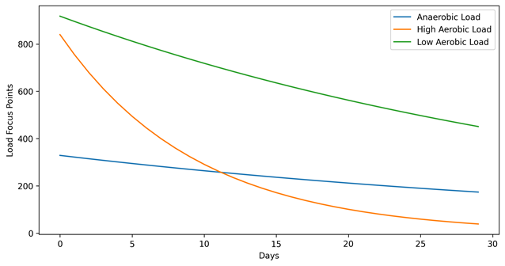

### **Formula for Load Focus Points Regression**  

Your **training load focus points** (anaerobic, high aerobic, and low aerobic) **decay over time** due to fitness detraining. Garmin typically follows an **exponential decay model**, meaning older training sessions contribute less to your load score. 

`Note: This is a single case study, and the findings may not be universally applicable. Further validation is needed to confirm if this pattern holds consistency.`

The **exponential decay formula** is:  

$$L_t = L_0 \times e^{-kt}$$

where:  
- \(L_t\) = Load at time \(t\)  
- \(L_0\) = Initial load (starting value)  
- \(k\) = Decay rate constant (depends on activity type)  
- \(t\) = Days since the training session  
- \(e\) = Euler's number (~2.718)  

---

### **Garmin's Approximate Decay Rates**  
Different training zones decay at different rates:  
- **Anaerobic Load:** $$\(k \approx 0.15\) per day (faster decay)$$
- **High Aerobic Load:** $$\(k \approx 0.10\) per day$$
- **Low Aerobic Load:** $$\(k \approx 0.07\) per day (slower decay)$$

---

### **Example of Your Load Decay Over Time**  

#### **Day 0 (Today):**  
- Anaerobic = **329**  
- High Aerobic = **840**  
- Low Aerobic = **918**  

#### **Day 3 (Min Delay for each intensity when no training):**  
Using the formula:  

$$L_3 = L_0 \times e^{-k(3)}$$

- **Anaerobic:**  
  $$329 \times e^{-0.022 \times 5} = 329 \times e^{-0.11} \approx 301$$
- **High Aerobic:**  
  $$840 \times e^{-0.106 \times 4} = 840 \times e^{-0.424} \approx 611$$
- **Low Aerobic:**  
  $$918 \times e^{-0.0245 \times 3} = 918 \times e^{-0.0735} \approx 874$$

#### **Day 7 (After a week of no training):**  
- **Anaerobic:**  
  $$329 \times e^{-0.022 \times 7} \approx 288$$
- **High Aerobic:**  
  $$840 \times e^{-0.106 \times 7} \approx 444$$
- **Low Aerobic:**  
  $$918 \times e^{-0.0245 \times 7} \approx 729$$

---

## **Training Zone Decay Table**

| **Training Type**  | **Decay Delay (Days)** | **Decay Rate (% per day)** | **Initial Load** | **Activated Muscle Groups** | **Key Hormones** |
|-------------------|------------------|------------------|----------------|-------------------------|----------------|
| **Low Aerobic**  | 3                | 2.45%            | 918            | Slow-twitch (Type I) fibers, Core, Calves, Hamstrings | **Endorphins:** These are your body's natural painkillers and mood elevators. Low aerobic exercise triggers their release, contributing to the "runner's high" feeling - [source](https://www.michiganmedicine.org/health-lab/bodys-natural-pain-killers-can-be-enhanced).    **Dopamine:** This neurotransmitter is associated with pleasure and motivation. Low aerobic activity can increase dopamine levels, promoting feelings of well-being - [soure](https://pmc.ncbi.nlm.nih.gov/articles/PMC3032992/).    **Cortisol:** In moderate amounts, cortisol can be beneficial, helping your body adapt to stress. Low aerobic exercise generally keeps cortisol levels in check. |
| **High Aerobic** | 3                | 10.6%            | 840            | Slow-twitch & Fast-twitch (Type I & Type IIa) fibers, Quads, Glutes, Hip flexors | **Growth hormone:** This hormone plays a role in muscle growth and repair. High aerobic exercise can stimulate its release. [source](https://www.betterhealth.vic.gov.au/health/conditionsandtreatments/growth-hormone)     **Epinephrine (adrenaline):** This hormone increases alertness and energy levels. High aerobic activity triggers its release, preparing your body for action. [source](https://www.endocrine.org/patient-engagement/endocrine-library/hormones-and-endocrine-function/adrenal-hormones)    **Glucagon:** This hormone helps regulate blood sugar levels. High aerobic exercise can stimulate its release, providing energy for your muscles. [source](https://diabetesjournals.org/spectrum/article/17/3/183/1994/Glucose-Metabolism-and-Regulation-Beyond-Insulin) |
| **Anaerobic**    | 5                | 2.2%             | 329            | Fast-twitch (Type IIa & IIb) fibers, Quads, Glutes, Hamstrings, Calves | **Testosterone:** This hormone plays a role in muscle growth and strength. Anaerobic exercise can stimulate its release, particularly in men.    **Lactic acid:** This is a byproduct of anaerobic metabolism. While it's often associated with muscle soreness, it can also act as a signaling molecule that promotes muscle growth. |

## **Decay Data Over Time**

The following table shows how the intensity points decay over time for each training zone.

| **Date**     | **Anaerobic** | **High Aerobic** | **Low Aerobic** |
|-------------|--------------|----------------|---------------|
| 2024-02-01  | 329.00       | 840.00         | 918.00        |
| 2024-02-02  | 321.84       | 755.52         | 895.78        |
| 2024-02-03  | 314.84       | 679.53         | 874.10        |
| 2024-02-04  | 307.99       | 611.19         | 852.95        |
| 2024-02-05  | 301.29       | 549.72         | 832.30        |
| 2024-02-06  | 294.73       | 494.43         | 812.16        |
| 2024-02-07  | 288.32       | 444.70         | 792.50        |
| 2024-02-08  | 282.04       | 399.97         | 773.32        |
| 2024-02-09  | 275.91       | 359.75         | 754.61        |
| 2024-02-10  | 269.90       | 323.57         | 736.34        |
| 2024-02-11  | 264.03       | 291.02         | 718.52        |
| 2024-02-12  | 258.28       | 261.75         | 701.13        |
| 2024-02-13  | 252.66       | 235.43         | 684.16        |
| 2024-02-14  | 247.17       | 211.75         | 667.61        |
| 2024-02-15  | 241.79       | 190.45         | 651.45        |
| 2024-02-16  | 236.53       | 171.30         | 635.68        |

## **Decay Trend Chart**

Below is a **visual representation** of the decay trend over time:

---
This chart visually represents the **decline in training load** over time for different intensity types.

## **Key Observations:**
- **Anaerobic decay is slow (2.2% per day) but starts declining significantly after 5 days.**
- **High Aerobic decays the fastest (10.6% per day) and requires more frequent training to maintain.**
- **Low Aerobic decays gradually (2.45% per day) and sustains endurance longer.**

---

If you **stop training for 2+ weeks**, your anaerobic fitness will drop **significantly**, while your endurance (low aerobic) will remain longer but still decline.  

---

### **How to Maintain Load Balance?**  
- **Anaerobic Workouts (Intervals/Sprints) → At least once per week** to maintain endurance base. 
- **High Aerobic (Threshold Runs) → 1–2 times per week** to sustain gains.  
- **Low Aerobic (Long Runs) →  Every 3–4 days** to prevent rapid loss. 
