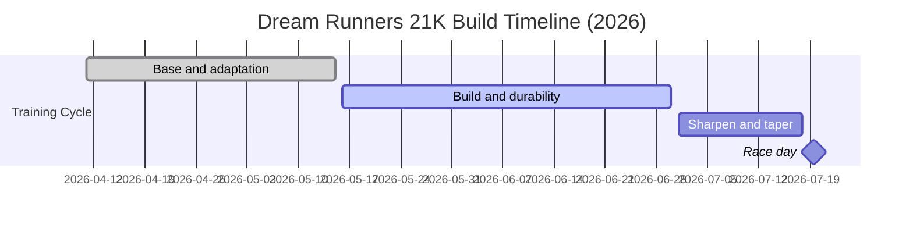
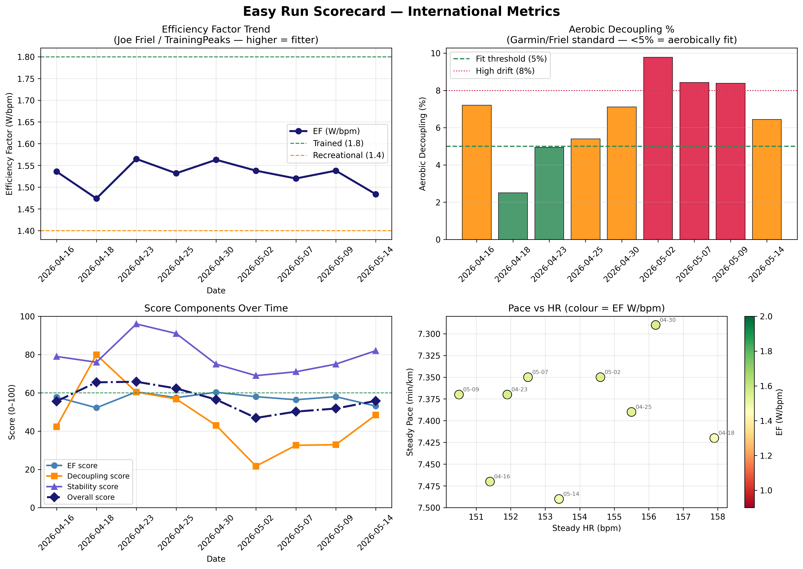
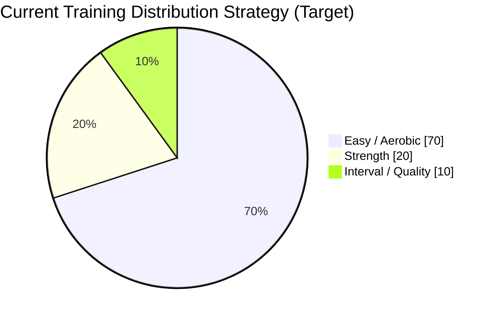

# Dream Runners 21K Longitudinal Running Research

## From Wearable Data to Real-World Half-Marathon Insights

### A longitudinal self-research project documenting cardiovascular drift, heat adaptation, hydration response, recovery, strength integration, and race-readiness using Garmin wearable data in Chennai conditions.

---

## Campaign Summary

| Item | Value |
|---|---|
| Goal race | Dream Runners 21K |
| Race date | 2026-07-19 |
| Training start | 2026-04-11 |
| Total build duration | 99 days (~14 weeks) |
| Current checkpoint date | 2026-06-23 |
| Days remaining to race | 26 |



---

## Introduction

Modern sports wearables generate rich physiological and mechanical data. This project uses those data streams to evaluate how endurance adaptation evolves over time in real-world running, not in laboratory conditions.

The DR 21K cycle is being used as a field study to answer one practical question:

Can race pace and endurance improve while cardiovascular and biomechanical cost become more stable?

Primary focus areas:

- Aerobic development
- Cardiovascular drift
- Heat adaptation (Chennai climate)
- Hydration response
- Recovery behavior
- Strength-training transfer
- Running economy
- Race-day durability

---

## Athlete Profile

| Field | Value |
|---|---|
| Device | Garmin Forerunner 255 |
| Climate | Chennai, India |
| Height | 174 cm |
| Weight band | ~73-75 kg |
| Session frequency | 3 runs/week + 2 strength workouts/week |
| Training types | Easy, threshold/interval, long run, strength |

### Key Physiological Reference

Confirmed lactate-threshold benchmark used in this repository:

- Threshold HR: 176 bpm
- Threshold pace: 5:13 per km
- Threshold power: 323 W
- Threshold power-to-weight: 4.32 W/kg

---

## Baseline Context (Early Cycle)

At the beginning of this cycle, the primary limitations were:

- Lower pace required to stay in easy aerobic zones
- More visible drift in longer sessions
- High weather sensitivity (heat and humidity)
- Less structured hydration and recovery routines
- Data available but not yet operationalized for decisions

The objective is therefore two-layered:

1. Improve race performance.
2. Build decision-grade evidence from day-to-day training data.

---

## Longitudinal Adaptation Themes

### 1) Aerobic Development

Observed direction: easy-run pace sustainability has improved while cardiovascular strain has become more controlled in matched efforts.

Interpretation:

- Better aerobic durability
- Lower perceived effort at similar output
- More stable long-run response

### 2) Cardiovascular Drift

Drift remains strongly affected by heat, humidity, hydration quality, and accumulated fatigue. The current signal suggests better overall stability versus early-cycle runs, while environmental stress still drives daily variance.

### 3) Heat Adaptation (Chennai)

Heat continues to influence HR, drift, and pace control. However, adaptation appears to be improving tolerance to hot sessions through repeated exposure and better pacing discipline.

### 4) Hydration Response

Hydration quality is one of the highest-impact controllable variables.

Lower hydration quality tends to align with:

- Higher HR and drift
- Earlier fatigue onset
- Slower post-run recovery

More structured hydration tends to align with:

- Better cardiovascular stability
- Lower effort for comparable work
- Better next-day readiness

### 5) Running Economy and Strength Integration

Economy is monitored through pace-HR-power coupling, cadence stability, and durability indicators. Strength work appears to support stability, posture consistency, and late-run resistance to form breakdown.

---

## Quantitative Snapshot (Latest Repo Findings)

The latest summary metrics in this repository indicate directional improvement in key durability indicators.

| Metric | Mean | Latest | Interpretation |
|---|---:|---:|---|
| CSI | 45.79 | 56.21 | Cadence stability trend improving |
| GDI | 38.18 | 64.38 | Ground-contact durability trend improving |
| FRS | 48.08 | 43.38 | Fatigue resistance signal mixed but actionable |
| BES | 48.53 | - | Economy signal improving across blocks |
| ADS | 49.11 | - | Overall adaptation score near neutral-to-positive trend |

```mermaid
xychart-beta
    title Adaptation Indicators (Mean vs Latest)
    x-axis [CSI, GDI, FRS]
    y-axis Score 0 --> 100
    bar [45.79, 38.18, 48.08]
    line [56.21, 64.38, 43.38]
```

---

## Visual Evidence from Existing Report Outputs

### HR Improvement Trend



### Training Distribution (Pyramid)




---

## Before vs Current Status

| Area | Before | Current Status |
|---|---|---|
| Aerobic efficiency | Lower | Improved |
| Cardiovascular drift | Higher | Reduced in many matched sessions |
| Heat tolerance | Lower | Improving |
| Hydration awareness | Limited | Structured and monitored |
| Cadence consistency | Variable | More stable |
| Recovery efficiency | Slower | Improved |
| Running economy | Lower | Improving |
| Training consistency | Building | Sustained |

---

## Limitations

- Single-athlete longitudinal dataset
- Real-world weather and schedule variability
- Garmin-derived estimates are field proxies, not lab diagnostics
- Not all sessions are fully matched-condition experiments
- Training cycle is still in progress

These limitations are expected in applied field research and are part of the practical value of this project.

---

## Race-Day Validation Plan (Dream Runners 21K)

The race on 2026-07-19 is the final validation point for this cycle.

Race-day checkpoints:

- HR stability by segment
- Drift behavior from first half to second half
- Hydration effectiveness
- Pace sustainability under heat and fatigue
- Economy retention under late-race load
- Power and cadence durability in final 5K


---

## Current Conclusion

At this checkpoint, the longitudinal signal supports meaningful adaptation across the current DR 21K cycle:

- Aerobic efficiency is improving.
- Cardiovascular stability is improving in many repeated contexts.
- Heat management appears better controlled.
- Hydration strategy is now a structured performance lever.
- Recovery behavior and economy signals are trending positive.

Final conclusions remain open until race-day execution data are added.

---

## Suggested Companion Files for Publication

To keep this report publication-ready for Medium and internal wiki use, pair this page with:

- `reports/hr_timeline_report.md`
- `reports/biomechanics_longitudinal_research_summary.md`
- `reports/hr_improvement_analysis.csv`
